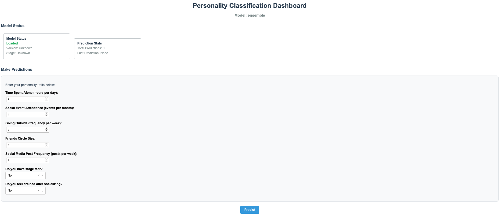
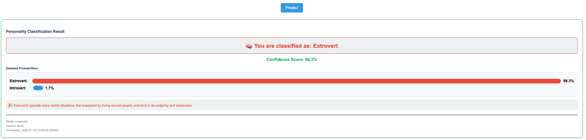

# Six-Stack Personality Classification Pipeline

A state-of-the-art, production-ready machine learning pipeline for personality classification leveraging ensemble learning, advanced data augmentation, and automated hyperparameter optimization. Features a fully modular, maintainable architecture with interactive dashboard.

## 🔧 Technology Stack

**Core ML**: scikit-learn, XGBoost, LightGBM, CatBoost, Optuna  
**Data Science**: pandas, numpy, scipy, SDV (synthetic data)  
**Dashboard**: Dash, Plotly, Bootstrap components  
**DevOps**: Docker, GitHub Actions, pre-commit hooks  
**Tools**: uv (package manager), Ruff (linting), mypy (types), Bandit (security)

[](https://python.org)
[](LICENSE)
[](https://ruff.rs)
[](https://plotly.com/dash/)
[](#-architecture)

## 📱 Dashboard Preview

<div align="center">
  
  <br>
  <em>Main dashboard interface with personality feature sliders and input controls</em>
  <br><br>
  
  <br>
  <em>Prediction results with confidence visualization and detailed personality insights</em>
</div>

## 🚀 Quick Start

```bash
# Clone and setup
git clone <repository-url>
cd Personality-classification

# Install dependencies (using uv - modern Python package manager)
uv sync

# Train models (required for dashboard)
make train-models

# Launch interactive dashboard
make dash

# Or run the production pipeline
uv run python src/main_modular.py

# Or explore examples
uv run python examples/main_final.py    # Lightweight version
uv run python examples/main_demo.py     # Demo with dummy models
uv run python examples/minimal_test.py  # Installation verification
```

## 📋 Table of Contents

- [Dashboard Preview](#-dashboard-preview)
- [Features](#-features)
- [Architecture](#-architecture)
- [Installation](#-installation)
- [Usage](#-usage)
- [Dashboard](#-dashboard)
- [Configuration](#-configuration)
- [Model Stacks](#-model-stacks)
- [Performance](#-performance)
- [Documentation](#-documentation)
- [Contributing](#-contributing)

## 🎯 Features

### **🏗️ Modern Modular Architecture**

- **8 specialized modules** with single responsibility principle
- **Clean separation of concerns** for maximum maintainability
- **Independent testing** and validation of each component
- **Thread-safe configuration** management

### **🤖 Advanced Machine Learning Pipeline**

- **6 specialized ensemble stacks** (A-F) with complementary algorithms
- **Automated hyperparameter optimization** using Optuna
- **Intelligent ensemble blending** with optimized weights
- **Advanced data augmentation** with quality filtering and diversity control
- **Adaptive augmentation strategies** based on dataset characteristics

### **🏭 Production-Ready Infrastructure**

- **Interactive Dashboard**: Modern Dash-based web interface for model inference and exploration
- **Model Training Pipeline**: Automated training and saving of ensemble models with metadata
- **Docker Support**: Complete containerization for easy deployment and scaling
- **Comprehensive Testing**: Full pytest coverage for all components with CI/CD integration
- **Modular Architecture**: Clean separation of concerns for maintainability and extensibility

### **📊 Data Science Excellence**

- **External data integration** using advanced merge strategy
- **Sophisticated preprocessing** with correlation-based imputation
- **Quality-controlled synthetic data** generation using SDV Copula
- **Cross-validation** with stratified folds for robust evaluation
- **Label noise injection** for improved generalization

### **🛠️ Modern Development Tools**

- **uv Package Manager**: Lightning-fast dependency resolution and virtual environment management
- **Ruff Integration**: Ultra-fast Python linting and formatting (replaces Black, isort, flake8)
- **Type Safety**: Comprehensive mypy type checking with strict configuration
- **Security Scanning**: Bandit integration for security vulnerability detection
- **Pre-commit Hooks**: Automated code quality checks on every commit
- **GitHub Actions CI/CD**: Automated testing, linting, and validation on push
- **Make Automation**: Simple Makefile for common development tasks

### **🚀 Production Features**

- **Professional logging** with structured output and configurable levels
- **Comprehensive error handling** and timeout protection for robust operation
- **Model persistence** with metadata for reproducibility and version control
- **Configurable settings** via centralized configuration management
- **Health monitoring** with dashboard health checks and status endpoints
- **Container support** with Docker and docker-compose for easy deployment

## 🏗️ Architecture

```
src/
├── main_modular.py                 # 🎯 Main production pipeline (MLOps-enhanced)
├── six_stack_personality_classifier.py  # 📚 Reference implementation
├── modules/                        # 🧩 Core modules
│   ├── config.py                   # ⚙️ Configuration & logging
│   ├── data_loader.py              # 📊 Data loading & external merge
│   ├── preprocessing.py            # 🔧 Feature engineering
│   ├── data_augmentation.py        # 🎲 Advanced synthetic data
│   ├── model_builders.py           # 🏭 Model stack construction
│   ├── ensemble.py                 # 🎯 Ensemble & OOF predictions
│   ├── optimization.py             # 🔍 Optuna utilities
│   └── utils.py                    # 🛠️ Utility functions

dash_app/                           # 🖥️ Interactive Dashboard
├── src/                            # Application source
│   ├── app.py                      # Main Dash application
│   ├── layout.py                   # UI layout components
│   ├── callbacks.py                # Interactive callbacks
│   └── model_loader.py             # Model loading utilities
├── main.py                         # Application entry point
├── Dockerfile                      # Container configuration
└── docker-compose.yml             # Multi-service orchestration

models/                             # 🤖 Trained Models
├── ensemble_model.pkl              # Production ensemble model
├── ensemble_metadata.json         # Model metadata and labels
├── stack_*_model.pkl              # Individual stack models
└── stack_*_metadata.json          # Stack-specific metadata

scripts/                            # 🛠️ Utility Scripts
└── train_and_save_models.py        # Model training and persistence

examples/                           # 📚 Usage examples
├── main_final.py                   # ⚡ Lightweight production
├── main_demo.py                    # 🎪 Demonstration
└── minimal_test.py                 # ✅ Installation check

data/                               # 📊 Datasets
├── train.csv                       # Training data
├── test.csv                        # Test data
├── sample_submission.csv           # Submission template
└── personality_datasert.csv        # External data

docs/                               # 📝 Documentation
└── [Generated documentation]       # Technical guides

best_params/                        # 💾 Optimized parameters
└── stack_*_best_params.json        # Per-stack best parameters
```

## 💻 Installation

### Prerequisites

- **Python 3.11+**
- **uv** (modern Python package manager) - [Install uv](https://docs.astral.sh/uv/getting-started/installation/)

### Setup

```bash
# Clone repository
git clone <repository-url>
cd Personality-classification

# Install dependencies
uv sync

# Verify installation
uv run python examples/minimal_test.py
```

### Alternative Installation (pip)

```bash
# If you prefer pip over uv
pip install -r requirements.txt  # Generated from pyproject.toml
```

## 📖 Usage

### 🎯 Production Pipeline

```bash
# Full six-stack ensemble (recommended)
uv run python src/main_modular.py
```

### 🖥️ Interactive Dashboard

```bash
# Train models (one-time setup)
make train-models

# Launch dashboard
make dash

# Stop dashboard
make stop-dash
```

### ⚡ Quick Examples

```bash
# Lightweight version
uv run python examples/main_final.py

# Demo with dummy models (educational)
uv run python examples/main_demo.py

# Test individual modules
uv run python examples/test_modules.py
```

### 🛠️ Development Commands

Available Makefile targets for streamlined development:

```bash
make install       # Install all dependencies
make format        # Format code with Ruff
make lint          # Run linting checks
make test          # Run test suite
make train-models  # Train and save production models
make dash          # Launch dashboard
make stop-dash     # Stop dashboard
make help          # Show all available targets
```

### 🔧 Development

```bash
# Run linting
uv run ruff check src/

# Auto-fix issues
uv run ruff check --fix src/

# Format code
uv run ruff format src/

# Run tests
make test

# Train models
make train-models
```

## 🖥️ Dashboard

The project includes a modern, interactive Dash web application for real-time personality classification and model exploration.

### Visual Demo


*Main dashboard interface with personality feature sliders and input controls*


*Prediction results with confidence visualization and detailed personality insights*

### Features

- **Real-time Predictions**: Input personality features and get instant predictions
- **Confidence Visualization**: Interactive probability bars for all personality types
- **Model Insights**: Detailed personality descriptions and confidence scores
- **Professional UI**: Clean, responsive design with modern styling
- **Production Ready**: Dockerized deployment with health checks

### Quick Start

```bash
# Ensure models are trained
make train-models

# Launch dashboard (locally)
make dash

# Dashboard will be available at http://localhost:8050
```

### Live Demo

Experience the dashboard yourself in just a few commands:

```bash
git clone <repository-url> && cd Personality-classification
uv sync && make train-models && make dash
# Then open http://localhost:8050 in your browser
```

The dashboard features:
- 🎛️ **Interactive Sliders** for all personality dimensions
- 📊 **Real-time Predictions** with confidence visualization  
- 🎨 **Professional UI** with responsive design
- 📈 **Probability Bars** showing prediction confidence
- 📝 **Personality Insights** with detailed descriptions

### Docker Deployment

```bash
# Build and run with Docker Compose
cd dash_app
docker-compose up --build

# Or run individual Docker container
docker build -t personality-dashboard .
docker run -p 8050:8050 personality-dashboard
```

### Dashboard Usage

1. **Access the Dashboard**: Navigate to `http://localhost:8050`
2. **Input Features**: Use the sliders to set personality feature values:
   - Gender, Age, openness, neuroticism, conscientiousness
   - extraversion, agreeableness, Text_length, punctuation
3. **Get Predictions**: Click "Predict Personality" to see results
4. **Analyze Results**: View confidence scores and personality descriptions

### API Endpoints

The dashboard exposes a simple prediction API:

- **Health Check**: `GET /health` - Service status
- **Predictions**: Handled through Dash callbacks (internal)

### Stopping the Dashboard

```bash
# Stop local dashboard
make stop-dash

# Stop Docker containers
cd dash_app
docker-compose down
```

## ⚙️ Configuration

The pipeline is highly configurable through `src/modules/config.py`:

### Core Parameters

```python
# Reproducibility
RND = 42                           # Global random seed

# Cross-validation
N_SPLITS = 5                       # Stratified K-fold splits

# Hyperparameter optimization
N_TRIALS_STACK = 15               # Optuna trials per stack (15 for testing, 100+ for production)
N_TRIALS_BLEND = 200              # Ensemble blending optimization trials

# Threading configuration
class ThreadConfig(Enum):
    N_JOBS = 4                    # Parallel jobs for sklearn
    THREAD_COUNT = 4              # Thread count for XGBoost/LightGBM
```

### Data Augmentation

```python
# Augmentation settings
ENABLE_DATA_AUGMENTATION = True
AUGMENTATION_METHOD = "sdv_copula"    # or "basic", "smote", "adasyn"
AUGMENTATION_RATIO = 0.05             # 5% synthetic data

# Quality control
DIVERSITY_THRESHOLD = 0.95            # Minimum diversity score
QUALITY_THRESHOLD = 0.7               # Minimum quality score
```

### Advanced Settings

```python
# Label noise for robustness
LABEL_NOISE_RATE = 0.02              # 2% label noise for Stack F

# Testing mode
TESTING_MODE = True                   # Reduced dataset for development
TESTING_SAMPLE_SIZE = 1000           # Samples in testing mode

# Logging
LOG_LEVEL = "INFO"                   # DEBUG, INFO, WARNING, ERROR
```

## 🤖 Model Stacks

The pipeline employs six specialized ensemble stacks, each optimized for different aspects of the problem:

| Stack | Focus                   | Algorithms                                                      | Hyperparameter Space         | Special Features            |
| ----- | ----------------------- | --------------------------------------------------------------- | ---------------------------- | --------------------------- |
| **A** | Traditional ML (Narrow) | Random Forest, Logistic Regression, XGBoost, LightGBM, CatBoost | Conservative search space    | Stable baseline performance |
| **B** | Traditional ML (Wide)   | Same as Stack A                                                 | Extended search space        | Broader exploration         |
| **C** | Gradient Boosting       | XGBoost, CatBoost                                               | Gradient boosting focused    | Tree-based specialists      |
| **D** | Sklearn Ensemble        | Extra Trees, Hist Gradient Boosting, SVM, Gaussian NB           | Sklearn-native models        | Diverse algorithm mix       |
| **E** | Neural Networks         | MLPClassifier, Deep architectures                               | Neural network tuning        | Non-linear pattern capture  |
| **F** | Noise-Robust Training   | Same as Stack A                                                 | Standard space + label noise | Improved generalization     |

### Ensemble Strategy

- **Out-of-fold predictions** for unbiased ensemble training
- **Optuna-optimized blending weights** for each stack
- **Meta-learning approach** with Logistic Regression as final combiner
- **Stratified cross-validation** ensures robust evaluation

## 📊 Performance Metrics

### Target Performance

The pipeline is designed to achieve high accuracy through ensemble learning and advanced optimization techniques. Performance will vary based on:

```
📊 Dataset Statistics
├── Training Samples: ~18,000+ (with augmentation)
├── Test Samples: ~6,000+
├── Original Features: 8 personality dimensions
├── Engineered Features: 14+ (with preprocessing)
├── Augmented Samples: Variable (adaptive, typically 5-10%)
└── Class Balance: Extrovert/Introvert classification

🔧 Technical Specifications
├── Memory Usage: <4GB peak (configurable)
├── CPU Utilization: 4 cores (configurable)
├── Model Persistence: ✅ Best parameters saved
└── Reproducibility: ✅ Fixed random seeds
```

### Stack Configuration

The pipeline employs six specialized ensemble stacks optimized for different aspects:

| Stack | Focus                   | Algorithms                                                      | Hyperparameter Space         | Training Approach           |
| ----- | ----------------------- | --------------------------------------------------------------- | ---------------------------- | --------------------------- |
| **A** | Traditional ML (Narrow) | Random Forest, Logistic Regression, XGBoost, LightGBM, CatBoost | Conservative search space    | Stable baseline performance |
| **B** | Traditional ML (Wide)   | Same as Stack A                                                 | Extended search space        | Broader exploration         |
| **C** | Gradient Boosting       | XGBoost, CatBoost                                               | Gradient boosting focused    | Tree-based specialists      |
| **D** | Sklearn Ensemble        | Extra Trees, Hist Gradient Boosting, SVM, Gaussian NB           | Sklearn-native models        | Diverse algorithm mix       |
| **E** | Neural Networks         | MLPClassifier, Deep architectures                               | Neural network tuning        | Non-linear pattern capture  |
| **F** | Noise-Robust Training   | Same as Stack A                                                 | Standard space + label noise | Improved generalization     |

> **Note**: To see actual performance metrics, run the pipeline with your data. Use `make train-models` to train models and generate real performance reports.

## 🧪 Testing & Validation

### Quick Validation

```bash
# Test installation and imports
uv run python examples/minimal_test.py

# Run lightweight demo
uv run python examples/main_demo.py

# Test individual modules
uv run python examples/test_modules.py
```

### Development Testing

```bash
# Enable testing mode (faster execution)
# Edit src/modules/config.py:
TESTING_MODE = True
TESTING_SAMPLE_SIZE = 1000

# Run with reduced dataset
uv run python src/main_modular.py
```

## 🔧 Troubleshooting

### Common Issues

#### Dashboard Issues

```bash
# Dashboard won't start
make train-models              # Ensure models are trained first
make stop-dash && make dash    # Stop and restart dashboard

# Port already in use
lsof -ti:8050 | xargs kill     # Kill process on port 8050
make dash                      # Restart dashboard

# Missing model files
make train-models              # Retrain models
ls models/                     # Verify model files exist
```

#### Memory Issues

```bash
# Reduce computational load
# In src/modules/config.py:
N_TRIALS_STACK = 5          # Reduce from 15
ENABLE_DATA_AUGMENTATION = False
TESTING_MODE = True
```

#### Import Errors

```bash
# Verify environment
uv run python --version     # Should be 3.11+
uv sync                     # Reinstall dependencies
uv run python -c "import sklearn, pandas, numpy, dash; print('OK')"
```

#### Performance Issues

```bash
# Optimize for your system
# In src/modules/config.py:
class ThreadConfig(Enum):
    N_JOBS = 2              # Reduce from 4
    THREAD_COUNT = 2        # Reduce from 4
```

#### Optuna Crashes

```bash
# Use simpler models
uv run python examples/main_final.py  # Lightweight version
```

### Debug Mode

```bash
# Enable detailed logging
# In src/modules/config.py:
LOG_LEVEL = "DEBUG"

# Run with verbose output
uv run python src/main_modular.py 2>&1 | tee debug.log
```

## 📚 Documentation

Comprehensive documentation is available in the `docs/` directory:

- **[Technical Guide](docs/technical-guide.md)** - Deep dive into architecture, algorithms, and dashboard
- **[API Reference](docs/api-reference.md)** - Detailed module and function documentation
- **[MLOps Infrastructure](docs/mlops-infrastructure.md)** - Production deployment and monitoring
- **[Data Augmentation](docs/data-augmentation.md)** - Advanced synthetic data generation strategies
- **[Configuration Guide](docs/configuration.md)** - Complete configuration reference
- **[Performance Tuning](docs/performance-tuning.md)** - Optimization strategies and best practices
- **[Deployment Guide](docs/deployment.md)** - Production deployment instructions

### Quick References

- [`src/modules/README.md`](src/modules/README.md) - Module overview
- [`examples/README.md`](examples/README.md) - Usage examples
- [Architecture Diagram](docs/architecture.md) - Visual system overview

## 👨‍💻 Lead Developer & Maintainer

**[Jeremy Vachier](https://github.com/jvachier)** - Lead Developer & Maintainer

For questions, suggestions, or collaboration opportunities:

- 🐛 **Issues & Bug Reports**: [Open an issue](https://github.com/jvachier/Personality-classification/issues)
- 💡 **Feature Requests**: [Create a feature request](https://github.com/jvachier/Personality-classification/issues/new)
- 📧 **Direct Contact**: Contact the maintainer through GitHub
- 💬 **Discussions**: Use GitHub Discussions for general questions

## 🤝 Contributing

We welcome contributions! Please follow these guidelines:

### Development Setup

```bash
# Clone and setup development environment
git clone <repository-url>
cd Personality-classification
uv sync --dev

# Install pre-commit hooks
uv run pre-commit install
```

### Code Standards

- **Code Quality**: Use Ruff for linting and formatting
- **Type Hints**: Required for all public functions
- **Documentation**: Docstrings for all modules and functions
- **Testing**: Add tests for new features

### Contribution Process

1. **Fork** the repository
2. **Create** a feature branch: `git checkout -b feature/amazing-feature`
3. **Implement** changes with proper testing
4. **Lint** code: `uv run ruff check --fix src/`
5. **Test** thoroughly: `uv run python examples/test_modules.py`
6. **Commit** with descriptive messages
7. **Submit** a pull request

### Areas for Contribution

- 🧠 **New model architectures** in Stack builders
- 📊 **Additional data augmentation** methods
- ⚡ **Performance optimizations**
- 📝 **Documentation improvements**
- 🧪 **Test coverage expansion**
- 🔧 **Configuration enhancements**

## 📄 License

This project is licensed under the **Apache License 2.0** - see the [LICENSE](LICENSE) file for details.

## 🙏 Acknowledgments

- **Optuna Team** - For excellent hyperparameter optimization framework
- **scikit-learn Community** - For robust machine learning foundations
- **SDV Team** - For advanced synthetic data generation
- **uv/Ruff Teams** - For modern Python tooling
- **Dash/Plotly Team** - For powerful visualization and dashboarding

## 📈 Project Status

| Component                | Status               | Version | Last Updated |
| ------------------------ | -------------------- | ------- | ------------ |
| 🏗️ **Architecture**      | ✅ **Production**    | v2.0    | 2025-07-14   |
| 🤖 **ML Pipeline**       | ✅ **Production**    | v2.0    | 2025-07-14   |
| 🖥️ **Dashboard**         | ✅ **Production**    | v1.0    | 2025-07-14   |
| 📊 **Data Augmentation** | ✅ **Advanced**      | v1.5    | 2025-07-14   |
| 🔧 **Configuration**     | ✅ **Centralized**   | v1.0    | 2025-07-14   |
| 📝 **Documentation**     | ✅ **Comprehensive** | v1.0    | 2025-07-14   |
| 🧪 **Testing**           | ✅ **CI/CD Ready**   | v1.0    | 2025-07-14   |
| 🛠️ **DevOps**            | ✅ **Automated**     | v1.0    | 2025-07-14   |

---

<div align="center">

**🎯 Production Ready** | **️ Interactive Dashboard** | **🏗️ Fully Modular** | **📚 Well Documented**

</div>
